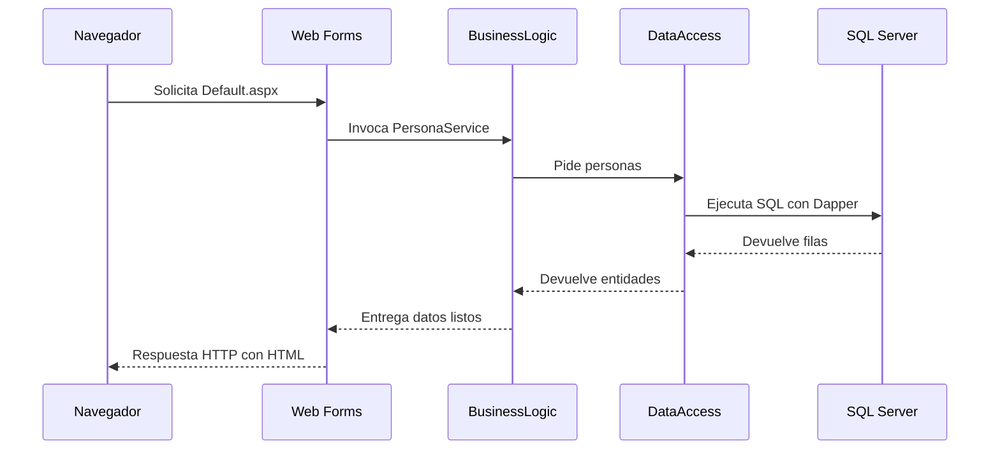
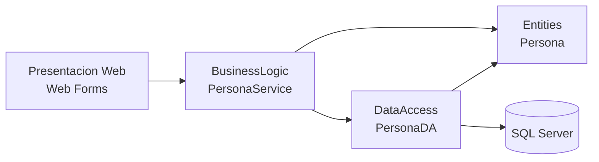

# Guía paso a paso: ejecución de ASP.NET Framework y arquitectura en capas

<div align="center">


</div>

> Nota visual: este documento explica el recorrido de una solicitud en la aplicación Web Forms y cómo se conectan la interfaz, la lógica de negocio y el acceso a datos.

## Navegacion rapida

- [Que es ASP.NET Framework](#1-que-es-aspnet-framework)
- [Requisitos](#2-requisitos-para-ejecutarlo)
- [Arquitectura del ejemplo](#3-arquitectura-del-ejemplo)
- [Estructura de proyectos](#4-estructura-de-proyectos)
- [Flujo de ejecucion](#5-que-ocurre-cuando-el-navegador-pide-la-pagina)
- [Explicacion de Default.aspx](#6-explicacion-paso-a-paso-de-defaultaspx)
- [Conexion y datos](#7-conexion-a-sql-server-y-clase-persona)



Este documento explica dos cosas:

1. Cómo está organizada la solución ASP.NET Framework del repositorio.
2. Cómo se procesa la página [Default.aspx](Default.aspx) junto con su code-behind [Default.aspx.cs](Default.aspx.cs).

---

## 1. ¿Qué es ASP.NET Framework?

ASP.NET Framework es la plataforma web clásica de Microsoft sobre .NET Framework. Históricamente nace como evolución de ASP clásico para ofrecer un modelo más estructurado, con controles de servidor, ciclo de vida de página, master pages y separación entre interfaz y lógica de eventos.

En este ejemplo se usa Web Forms, que fue muy popular para aplicaciones empresariales por su modelo basado en eventos y por facilitar pantallas CRUD con poco código visual.

---

## 2. Requisitos para ejecutarlo

Para abrir el ejemplo necesitas lo siguiente:

- Windows con IIS o IIS Express.
- Visual Studio con soporte para proyectos Web Forms.
- .NET Framework 4.8.1.
- SQL Server accesible con la base de datos `Ejemplo2`.
- La tabla `[dbo].[Persona]` creada con datos de prueba.

La aplicación usa una cadena de conexión definida en [Web.config](Web.config) y consultas SQL directas con Dapper.

---

## 3. Arquitectura del ejemplo

La solución sigue una arquitectura n-capas simple, separando responsabilidades.

### Capas principales

1. Presentación web: [Default.aspx](Default.aspx)
2. Lógica de negocio: [PersonaService.cs](../ASPNetSample.BusinessLogic/PersonaService.cs)
3. Acceso a datos: [PersonaDA.cs](../ASPNetSample.DataAccess/PersonaDA.cs)
4. Entidades compartidas: [Persona.cs](../ASPNetSample.Entities/Persona.cs)



La idea central es esta:

- La capa web muestra la interfaz y responde a eventos de página.
- BusinessLogic concentra la coordinación del caso de uso.
- DataAccess ejecuta consultas y comandos SQL.
- Entities define los modelos que viajan entre capas.

---

## 4. Estructura de proyectos

La solución se organiza por proyecto, no todo dentro de una sola aplicación.

### Proyecto de presentación

- [Default.aspx](Default.aspx): markup de la página.
- [Default.aspx.cs](Default.aspx.cs): lógica del evento `Page_Load`.
- [Plantilla.Master](Plantilla.Master): master page compartida.
- [Web.config](Web.config): configuración y cadena de conexión.

### Proyecto de negocio

- [PersonaService.cs](../ASPNetSample.BusinessLogic/PersonaService.cs): expone operaciones como `GetAllPersonas`.

### Proyecto de acceso a datos

- [PersonaDA.cs](../ASPNetSample.DataAccess/PersonaDA.cs): ejecuta SQL con Dapper.

### Proyecto de entidades

- [Persona.cs](../ASPNetSample.Entities/Persona.cs): modelo de datos usado por Dapper y la UI.

Este patrón es típico en aplicaciones Web Forms mantenibles: la página no debería hablar con SQL directamente si se busca orden y crecimiento razonable.

---

## 5. Qué ocurre cuando el navegador pide la página

El flujo real de ejecución es este:

1. El navegador solicita `Default.aspx`.
2. IIS o IIS Express recibe la petición.
3. ASP.NET Framework activa el ciclo de vida de la página Web Forms.
4. Se ejecuta `Page_Load` en [Default.aspx.cs](Default.aspx.cs).
5. Si no es un postback, se llama a `LoadPersons()`.
6. `PersonaService` pide las personas a `PersonaDA`.
7. `PersonaDA` consulta SQL Server con Dapper.
8. El `GridView` enlaza los datos y la página se renderiza como HTML.

El navegador nunca ve el código C# original; solo recibe el HTML final generado por el servidor.

---

## 6. Explicacion paso a paso de Default.aspx

### 6.1 Directiva de la página

```aspx
<%@ Page Title="" Language="C#" MasterPageFile="~/Plantilla.Master" AutoEventWireup="true" CodeBehind="Default.aspx.cs" Inherits="ASPNetSample.Default" %>
```

Aquí se indica que la página usa C#, una master page y un code-behind asociado.

### 6.2 Contenido principal

```aspx
<asp:Panel ID="pnlMessage" CssClass="alert alert-danger" runat="server">
    <asp:Label ID="lblMessage" Text="text" runat="server" />
</asp:Panel>
<asp:GridView ID="gvMain" runat="server" CssClass="table table-striped mt-3"></asp:GridView>
```

La página tiene dos elementos clave:

- Un panel de mensaje para mostrar errores.
- Un GridView para mostrar el listado de personas.

### 6.3 Ciclo de carga

En [Default.aspx.cs](Default.aspx.cs), el método `Page_Load` hace dos cosas:

- Oculta el panel de mensajes al iniciar.
- Carga los datos solo cuando la página no viene de un postback.

Esto evita recargar la grilla en cada interacción de formulario.

### 6.4 Método LoadPersons

```csharp
PersonaService service = new PersonaService();
List<Persona> personas = service.GetAllPersonas().ToList();
gvMain.DataSource = personas;
gvMain.DataBind();
```

El método toma los datos del servicio, los convierte a lista y los enlaza al GridView.

### 6.5 Manejo de errores

Si algo falla, `MostrarMensaje()` hace visible el panel y presenta el texto del error.

---

## 7. Conexion a SQL Server y clase Persona

### 7.1 Cadena de conexión

En [Web.config](Web.config) se define la conexión llamada `cnx`:

```xml
<add name="cnx" connectionString="Server=(local);Database=Ejemplo2;User Id=sa;Password=WRITEYOURPASSWORD!;"/>
```

Ese valor alimenta a [PersonaDA.cs](../ASPNetSample.DataAccess/PersonaDA.cs) mediante `ConfigurationManager.ConnectionStrings`.

### 7.2 Acceso a datos con Dapper

[PersonaDA.cs](../ASPNetSample.DataAccess/PersonaDA.cs) abre una `SqlConnection`, ejecuta consultas y mapea filas a objetos `Persona`.

### 7.3 Entidad Persona

La clase [Persona.cs](../ASPNetSample.Entities/Persona.cs) contiene las propiedades que viajan entre la base de datos, la lógica y la interfaz:

- `PersonaID`
- `Nombre`
- `Tipo`
- `Gender`
- `Password`

---

## 8. Cómo se suele estructurar este tipo de proyecto

En proyectos ASP.NET Framework con Web Forms es común encontrar:

- Un proyecto web de presentación.
- Uno o más proyectos de biblioteca para negocio y datos.
- Entidades compartidas como contrato entre capas.
- Configuración centralizada en `Web.config`.
- Master pages para mantener diseño consistente.

En este repositorio se ve justamente ese esquema, con una separación suficiente para enseñar buenas prácticas sin volver el ejemplo demasiado complejo.

---

## 9. Conclusión

Este ejemplo muestra cómo ASP.NET Framework organiza una aplicación por capas y cómo Web Forms resuelve el ciclo de vida de la página en el servidor. Es una base útil para entender aplicaciones heredadas y para aprender el valor de separar interfaz, negocio y acceso a datos.
