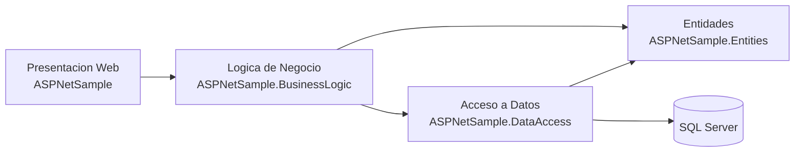
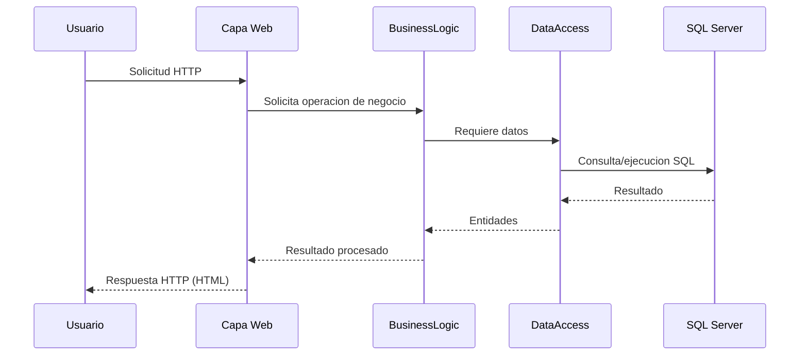

# Resumen de materia: ASP .NET Framework y arquitectura n-capas

## Navegacion rapida

- [ASP .NET Framework en el curso](#asp-net-framework-en-el-curso)
- [Arquitectura del ejemplo](#arquitectura-del-ejemplo-en-este-repositorio)
- [Flujo de una solicitud](#flujo-general-de-una-solicitud)
- [Ventajas de n-capas](#ventajas-de-la-arquitectura-n-capas)
- [Buenas practicas sugeridas](#buenas-practicas-sugeridas-para-clase)

## ASP .NET Framework en el curso

ASP .NET Framework es una plataforma de Microsoft para construir aplicaciones web sobre .NET Framework. En este curso se usa para que los estudiantes comprendan como se organiza una aplicacion web en capas, separando interfaz, reglas de negocio y acceso a datos.

La idea didactica no es solo "hacer que funcione", sino entender como estructurar proyectos que puedan crecer, mantenerse y probarse con menor riesgo.

## Arquitectura del ejemplo en este repositorio

El ejemplo de la solucion en [ASPNetSample/ASPNetSample.sln](ASPNetSample.sln) esta dividido en capas/proyectos:

1. Capa de presentacion web: [ASPNetSample/ASPNetSample](ASPNetSample)
2. Capa de logica de negocio: [ASPNetSample/ASPNetSample.BusinessLogic](ASPNetSample.BusinessLogic)
3. Capa de acceso a datos: [ASPNetSample/ASPNetSample.DataAccess](ASPNetSample.DataAccess)
4. Capa de entidades (modelos compartidos): [ASPNetSample/ASPNetSample.Entities](ASPNetSample.Entities)

Representacion de arquitectura:

Direccion de dependencias observada:

- La capa web depende de BusinessLogic y Entities.
- BusinessLogic depende de DataAccess y Entities.
- DataAccess depende de Entities.
- Entities no depende de las otras capas.

Esta direccion evita acoplamiento circular y facilita el mantenimiento del sistema.

## Flujo general de una solicitud

En clase conviene explicar este flujo como una cadena de responsabilidades: cada capa hace su parte y delega el resto.

## Ventajas de la arquitectura n-capas

1. Separacion de responsabilidades: cada proyecto tiene un rol claro.
2. Mantenibilidad: cambiar una capa afecta menos a las demas.
3. Escalabilidad tecnica: es mas facil agregar funciones sin romper todo.
4. Reutilizacion: la logica y las entidades se pueden reutilizar en otras interfaces.
5. Testabilidad: la logica de negocio se puede probar sin depender de la interfaz web.
6. Orden para equipos: varios estudiantes pueden trabajar por capa sin pisarse tanto.
7. Evolucion gradual: permite migrar una capa a otra tecnologia con menos impacto.

## Buenas practicas sugeridas para clase

- Mantener la logica de negocio fuera de la capa web.
- Evitar que la capa web consulte la BD directamente.
- Definir entidades claras para transportar datos entre capas.
- Centralizar conexiones y consultas en DataAccess.
- Documentar el flujo de extremo a extremo antes de programar nuevas funciones.

## Conclusión

Este ejemplo de ASP .NET Framework es util para enseñar arquitectura de software aplicada a desarrollo web: no solo se aprende a responder solicitudes HTTP, sino a organizar una solucion profesional en n-capas para que sea entendible, mantenible y ampliable.
