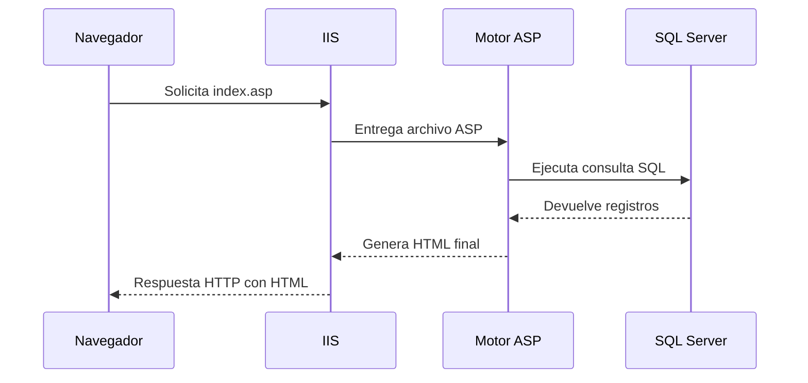

# Guía paso a paso: ejecución de ASP clásico e interpretación del código

<div align="center">


</div>

> Nota visual: este documento explica la ejecucion desde el lado del servidor, desde la solicitud del navegador hasta el HTML final que recibe el cliente.

## Navegacion rapida

- [Que es ASP clasico](#1-que-es-asp-clasico)
- [Requisitos](#2-requisitos-para-hacerlo-correr)
- [Base de datos usada](#21-base-de-datos-usada-por-el-ejemplo)
- [Como ejecutar la pagina](#4-como-ejecutar-la-pagina)
- [Flujo de ejecucion](#5-que-ocurre-cuando-el-navegador-pide-la-pagina)
- [Explicacion de index.asp](#6-explicacion-paso-a-paso-de-indexasp)



Este documento explica dos cosas:

1. Cómo ejecutar un archivo ASP clásico en IIS.
2. Cómo se interpreta, paso a paso, el archivo [index.asp](index.asp) desde el lado del servidor.

---

## 1. ¿Qué es ASP clásico?

ASP clásico es una tecnología de Microsoft para generar contenido web dinámico desde el servidor. El navegador no ejecuta el código ASP; quien lo interpreta es IIS, mediante el motor de ASP clásico instalado en Windows.

Cuando el usuario solicita una página `.asp`, IIS procesa el archivo en el servidor, ejecuta el código VBScript y devuelve al navegador únicamente el HTML resultante.

---

## 2. Requisitos para hacerlo correr

Para ejecutar ASP clásico necesitas lo siguiente:

- Windows con IIS instalado.
- La característica de ASP clásico habilitada en IIS.
- Un sitio web configurado en IIS.
- El archivo `index.asp` dentro de la carpeta del sitio.
- Acceso a SQL Server y a la base de datos creada con `ScriptBD.sql`.

En este caso, el archivo usa una conexión a SQL Server con ADO y consulta la tabla `[dbo].[Persona]`.

---

## 2.1. Base de datos usada por el ejemplo

El archivo `ScriptBD.sql` crea la base de datos `Ejemplo2` y define varias tablas relacionadas con personas y roles.

### Tablas principales

- `Persona`: almacena el identificador, nombre, tipo, género y contraseña.
- `PersonaRol`: relaciona personas con roles.
- `Rol`: almacena los roles disponibles.
- `Telefono`: almacena teléfonos asociados a una persona.

### Relación con `index.asp`

La página `index.asp` ejecuta esta consulta:

```sql
SELECT [PersonaID],[Nombre],[Tipo],[Gender] FROM [dbo].[Persona]
```

Por eso, para que la página funcione correctamente, la base de datos `Ejemplo2` debe existir y la tabla `Persona` debe estar creada.

---

## 3. Cómo habilitar ASP clásico en IIS

### Paso 1: abrir las características de Windows

1. Abrir el Panel de control.
2. Ir a Programas.
3. Seleccionar Activar o desactivar las características de Windows.

### Paso 2: habilitar IIS

1. Buscar Internet Information Services.
2. Expandir el árbol de componentes.
3. Verificar que estén activadas las herramientas de administración.

### Paso 3: habilitar ASP clásico

1. Dentro de IIS, expandir World Wide Web Services.
2. Entrar a Application Development Features.
3. Marcar ASP.

### Paso 4: confirmar el sitio

1. Abrir IIS Manager.
2. Crear o seleccionar un sitio web.
3. Apuntar el sitio a la carpeta donde está `index.asp`.
4. Verificar que el sitio tenga un binding con puerto, por ejemplo `80`.

### Paso 5: revisar el acceso a SQL Server

1. Confirmar que el servicio de SQL Server esté iniciado.
2. Verificar que la instancia local esté disponible.
3. Revisar que el usuario `sa` o el usuario configurado tenga permisos sobre `Ejemplo2`.
4. Asegurar que la autenticación usada en la cadena de conexión coincida con la configuración del servidor.

---

## 4. Cómo ejecutar la página

### Paso 1: ubicar el archivo

Coloca `index.asp` dentro de la carpeta física del sitio, por ejemplo:

```text
C:\Sites\ClassicASP\index.asp
```

### Paso 2: configurar documento predeterminado

Si quieres que el sitio abra automáticamente el archivo, agrega `index.asp` como documento predeterminado en IIS.

### Paso 3: iniciar el sitio

En IIS Manager:

1. Selecciona el sitio.
2. Haz clic en Start si está detenido.

### Paso 4: abrir desde el navegador

Ingresa la URL del sitio, por ejemplo:

```text
http://localhost/
```

Si todo está correcto, IIS intercepta la solicitud, ejecuta el archivo ASP y devuelve la página HTML generada.

---

## 5. Qué ocurre cuando el navegador pide la página

El flujo real de ejecución es este:

1. El navegador solicita `index.asp`.
2. IIS recibe la petición.
3. IIS reconoce que el archivo es ASP clásico.
4. El motor ASP interpreta el código VBScript dentro de las etiquetas `<% %>`.
5. El código se ejecuta en el servidor.
6. El servidor construye el HTML final.
7. Ese HTML se envía al navegador.

El navegador nunca ve el VBScript original. Solo recibe el resultado procesado.

---

## 6. Explicación paso a paso de `index.asp`

### 6.1 Directiva inicial

```asp
<%@ Language="VBScript" %>
```

Esta línea le indica a ASP que el lenguaje de script usado será VBScript.

### 6.2 Estructura HTML general

```html
<!DOCTYPE html>
<html>
<head>
    <title>Mi P&aacute;gina ASP Cl&aacute;sico</title>
```

Aquí comienza la parte HTML normal de la página. IIS no interpreta estas etiquetas como código; las envía como parte del resultado final.

### 6.3 Inclusión de Bootstrap

```html
<link href="https://cdn.jsdelivr.net/npm/bootstrap@5.3.3/dist/css/bootstrap.min.css" rel="stylesheet" ...>
```

Bootstrap se carga desde un CDN para dar estilo a la tabla y a los elementos de la página.

### 6.4 Inicio del cuerpo

```html
<body>
    <div class="container">
        <h1 class="mt-5">Resultados de la Base de Datos</h1>
```

Se muestra un encabezado visible para el usuario. Esto forma parte del HTML final que el navegador verá.

### 6.5 Creación de la tabla

```html
<table class='table table-bordered table-striped table-hover mt-3'>
<thead class='thead-dark'><tr><th>PersonaID</th><th>Nombre</th></tr></thead>
<tbody>
```

La tabla se prepara antes de ejecutar la consulta. El contenido de `<tbody>` será rellenado dinámicamente desde el servidor.

### 6.6 Inicio del bloque ASP

```asp
<%
```

Desde aquí comienza el código que IIS interpreta del lado del servidor.

### 6.7 Declaración de variables

```vbscript
Dim conn, rs
```

Se declaran dos objetos:

- `conn` para la conexión a la base de datos.
- `rs` para almacenar el conjunto de resultados de la consulta.

### 6.8 Creación de la conexión

```vbscript
Set conn = Server.CreateObject("ADODB.Connection")
```

ASP crea un objeto ADO de tipo conexión. Este objeto permite conectarse a SQL Server.

### 6.9 Apertura de la conexión

```vbscript
conn.Open "Provider=SQLOLEDB;Data Source=(local);Initial Catalog=Ejemplo2;User ID=sa;Password=Holamundo1!;"
```

Aquí se establece la conexión con SQL Server.

Paso a paso:

1. `Provider=SQLOLEDB` indica el proveedor ADO para SQL Server.
2. `Data Source=(local)` apunta al servidor local.
3. `Initial Catalog=Ejemplo2` selecciona la base de datos.
4. `User ID=sa` y `Password=...` indican las credenciales.

En este punto, si la conexión falla, la página puede devolver un error del servidor.

### 6.9.1 Configuración de la base de datos

Antes de ejecutar `index.asp`, conviene tener en cuenta lo siguiente:

1. Ejecutar `ScriptBD.sql` en SQL Server para crear `Ejemplo2`.
2. Confirmar que la tabla `Persona` exista dentro de la base de datos.
3. Insertar datos de prueba para que la consulta devuelva resultados.
4. Revisar que la cadena de conexión apunte a la instancia correcta.
5. Si el servidor usa otro método de autenticación, ajustar `User ID` y `Password`.

### 6.10 Ejecución de la consulta

```vbscript
Set rs = conn.Execute("SELECT [PersonaID],[Nombre],[Tipo],[Gender] FROM [dbo].[Persona]")
```

El servidor envía la consulta a SQL Server y recibe los registros de la tabla `Persona`.

Aunque la consulta obtiene cuatro columnas, más adelante solo se usan `PersonaID` y `Nombre` para mostrar la tabla.

### 6.11 Verificación de resultados

```vbscript
If Not rs.EOF Then
```

`EOF` significa End Of File. En un recordset, indica si ya no hay más registros.

Si no está en EOF, significa que sí se encontraron resultados.

### 6.12 Recorrido del recordset

```vbscript
Do While Not rs.EOF
```

Se inicia un ciclo que recorre cada fila obtenida de la base de datos.

### 6.13 Generación de una fila HTML

```vbscript
Response.Write "<tr>"
Response.Write "<td>" & rs("PersonaID") & "</td>"
Response.Write "<td>" & rs("Nombre") & "</td>"
Response.Write "</tr>"
```

Esta es la parte clave del lado del servidor:

1. El servidor lee la fila actual del recordset.
2. Construye cadenas HTML con `Response.Write`.
3. Inserta los valores de la base de datos dentro de la tabla.
4. Envía ese HTML al resultado final.

El navegador no recibe instrucciones para conectarse a la base de datos. Solo recibe la fila ya armada como HTML.

### 6.14 Avance al siguiente registro

```vbscript
rs.MoveNext
```

Se mueve a la siguiente fila del recordset para repetir el proceso.

### 6.15 Fin del ciclo

```vbscript
Loop
```

El ciclo termina cuando ya no quedan más registros.

### 6.16 Caso sin resultados

```vbscript
Else
    Response.Write "<div class='alert alert-warning mt-3'>No se encontraron resultados.</div>"
End If
```

Si la consulta no devuelve filas, el servidor genera un mensaje de advertencia en HTML.

### 6.17 Cierre de objetos ADO

```vbscript
rs.Close
Set rs = Nothing
conn.Close
Set conn = Nothing
```

Esto libera recursos del servidor:

- Se cierra el recordset.
- Se libera la referencia del objeto.
- Se cierra la conexión a la base de datos.
- Se limpian los objetos para evitar consumo innecesario de memoria.

### 6.18 Fin del bloque ASP

```asp
%>
```

Termina el código ejecutado por el motor ASP.

### 6.19 Cierre del HTML

```html
    </div>
    <script src="https://cdn.jsdelivr.net/npm/bootstrap@5.3.3/dist/js/bootstrap.bundle.min.js" ...></script>
</body>
</html>
```

Una vez generada la salida dinámica, IIS completa el HTML y lo entrega al navegador.

---

## 7. Resumen del flujo de ejecución

El comportamiento puede resumirse así:

1. El navegador pide `index.asp`.
2. IIS detecta que es ASP clásico.
3. El motor ASP ejecuta el bloque VBScript.
4. Se abre la conexión a SQL Server.
5. Se ejecuta la consulta.
6. Se recorren los resultados.
7. Se generan filas HTML con `Response.Write`.
8. IIS envía el HTML final al navegador.


---

## 8. Conclusión

ASP clásico permite entender de forma muy clara la diferencia entre el código del lado del servidor y el resultado que ve el usuario. En este ejemplo, IIS procesa el archivo, ejecuta VBScript, consulta SQL Server y entrega al navegador una tabla HTML ya construida.