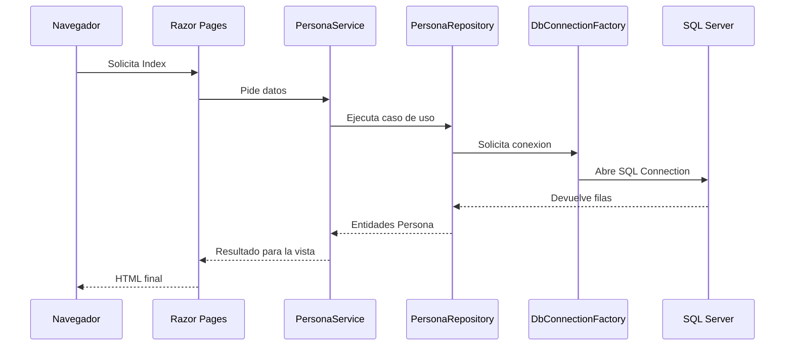
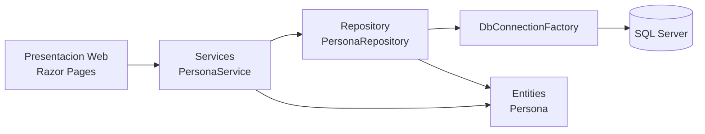

# Guía paso a paso: ejecución de ASP.NET Core y arquitectura moderna por capas

<div align="center">


</div>

> Nota visual: este documento explica el arranque de la app, el flujo de Razor Pages y la separación entre UI, servicios, repositorios y entidades.

## Navegacion rapida

- [Que es ASP.NET Core](#1-que-es-aspnet-core)
- [Requisitos](#2-requisitos-para-ejecutarlo)
- [Arquitectura del ejemplo](#3-arquitectura-del-ejemplo)
- [Estructura de proyectos](#4-estructura-de-proyectos)
- [Flujo de ejecucion](#5-que-ocurre-cuando-el-navegador-pide-la-pagina)
- [Explicacion de Program.cs](#6-explicacion-paso-a-paso-de-programcs)
- [Pagina Index y capas internas](#7-pagina-index-y-capas-internas)
- [Conexion y entidad Persona](#8-conexion-a-sql-server-y-clase-persona)



Este documento explica dos cosas:

1. Cómo está organizada la solución ASP.NET Core del repositorio.
2. Cómo fluye la ejecución desde [Program.cs](Program.cs) hasta la página Razor [Index.cshtml](Pages/Index.cshtml).

---

## 1. ¿Qué es ASP.NET Core?

ASP.NET Core es la evolución moderna de ASP.NET. Nace como una reescritura multiplataforma, más modular y orientada a inyección de dependencias, rendimiento y despliegue flexible.

Históricamente marca el paso desde el modelo clásico fuertemente acoplado de ASP.NET Framework hacia una plataforma unificada, más ligera y preparada para contenedores, nube y desarrollo moderno.

En este ejemplo se usa Razor Pages, un modelo centrado en páginas que reduce la fricción cuando la aplicación está orientada a pantallas simples o flujos CRUD.

---

## 2. Requisitos para ejecutarlo

Para abrir el ejemplo necesitas lo siguiente:

- .NET 8 instalado.
- Visual Studio, VS Code o cualquier editor compatible con proyectos `Sdk`.
- SQL Server accesible con la base de datos `Ejemplo2`.
- La tabla `Persona` creada con datos de prueba.

La aplicación usa [appsettings.json](appsettings.json) para la cadena de conexión y registra servicios en el contenedor de dependencias.

---

## 3. Arquitectura del ejemplo

La solución sigue una separación clara por responsabilidades y usa inyección de dependencias.

### Capas principales

1. Presentación web: [Pages/Index.cshtml](Pages/Index.cshtml)
2. Servicios: [PersonaService.cs](../CoreWebSample.Services/PersonaService.cs)
3. Acceso a datos: [PersonaRepository.cs](../CoreWebSample.Repository/PersonaRepository.cs)
4. Entidades: [Persona.cs](../CoreWebSample.Entities/Persona.cs)



La idea central es esta:

- La UI presenta datos y eventos de página.
- Services coordina la operación de negocio.
- Repository ejecuta consultas con Dapper.
- DbConnectionFactory encapsula la creación de conexiones.
- Entities define el contrato de datos.

---

## 4. Estructura de proyectos

La solución está dividida en proyectos pequeños y enfocados.

### Proyecto web

- [Program.cs](Program.cs): configura servicios y middleware.
- [Pages/Index.cshtml](Pages/Index.cshtml): página principal Razor.
- [Pages/Index.cshtml.cs](Pages/Index.cshtml.cs): PageModel asociado.
- [appsettings.json](appsettings.json): configuración general y cadena de conexión.

### Proyecto de servicios

- [PersonaService.cs](../CoreWebSample.Services/PersonaService.cs): expone la lógica de aplicación.
- [Abstract/IPersonaService.cs](../CoreWebSample.Services/Abstract/IPersonaService.cs): contrato del servicio.

### Proyecto de repositorio

- [PersonaRepository.cs](../CoreWebSample.Repository/PersonaRepository.cs): consultas SQL con Dapper.
- [DbConnectionFactory.cs](../CoreWebSample.Repository/DbConnectionFactory.cs): crea `IDbConnection`.
- [IDbConnectionFactory.cs](../CoreWebSample.Repository/IDbConnectionFactory.cs): contrato de la factoría.

### Proyecto de entidades

- [Persona.cs](../CoreWebSample.Entities/Persona.cs): modelo compartido por UI, servicios y datos.

Este tipo de estructura es común en ASP.NET Core cuando se quiere una aplicación sencilla pero organizada, con separación real entre infraestructura, lógica y presentación.

---

## 5. Qué ocurre cuando el navegador pide la página

El flujo real de ejecución es este:

1. El navegador solicita la página inicial.
2. ASP.NET Core levanta el host definido en `Program.cs`.
3. Se registran las dependencias en el contenedor.
4. La petición llega a Razor Pages.
5. `IndexModel` se instancia mediante DI.
6. Si la página necesita datos, el PageModel llama a `IPersonaService`.
7. `PersonaService` delega en `PersonaRepository`.
8. `PersonaRepository` usa `DbConnectionFactory` para abrir la conexión.
9. Dapper consulta SQL Server y devuelve entidades.
10. Razor renderiza el HTML final.

La diferencia clave frente a ASP.NET Framework es que aquí todo está más alineado con el modelo moderno de middleware, DI y async.

---

## 6. Explicacion paso a paso de Program.cs

### 6.1 Creación del builder

```csharp
var builder = WebApplication.CreateBuilder(args);
```

Aquí empieza el host mínimo de ASP.NET Core.

### 6.2 Registro de servicios

```csharp
builder.Services.AddRazorPages();
builder.Services.AddSingleton<IDbConnectionFactory, DbConnectionFactory>();
builder.Services.AddScoped<PersonaRepository>();
builder.Services.AddScoped<IPersonaService, PersonaService>();
```

Se registra lo necesario para que el contenedor resuelva la UI, el repositorio y el servicio.

### 6.3 Construcción de la app

```csharp
var app = builder.Build();
```

Con esto se materializa la aplicación y se prepara el pipeline HTTP.

### 6.4 Middleware y mapeo

```csharp
app.UseStaticFiles();
app.UseRouting();
app.UseAuthorization();
app.MapRazorPages();
app.Run();
```

ASP.NET Core usa middleware encadenado. El pipeline determina cómo se procesa cada solicitud.

---

## 7. Pagina Index y capas internas

### 7.1 PageModel

En [Pages/Index.cshtml.cs](Pages/Index.cshtml.cs), `IndexModel` representa la lógica de la página.

Por ahora el ejemplo base tiene un `OnGet()` vacío, lo que sirve para mostrar la estructura mínima de Razor Pages.

### 7.2 Vista Razor

En [Pages/Index.cshtml](Pages/Index.cshtml) se define la interfaz HTML de la página principal.

### 7.3 Servicio de aplicación

[PersonaService.cs](../CoreWebSample.Services/PersonaService.cs) implementa `IPersonaService` y delega toda la persistencia al repositorio.

### 7.4 Repositorio

[PersonaRepository.cs](../CoreWebSample.Repository/PersonaRepository.cs) ejecuta consultas como:

```sql
SELECT PersonaID, Nombre, Tipo, Gender, Password FROM Persona
```

Todas las operaciones están en versiones asíncronas, lo cual es coherente con ASP.NET Core y con aplicaciones que pueden escalar mejor bajo carga.

---

## 8. Conexion a SQL Server y clase Persona

### 8.1 Cadena de conexión

En [appsettings.json](appsettings.json) la cadena se define en `ConnectionStrings:DefaultConnection`.

### 8.2 Factoría de conexiones

[DbConnectionFactory.cs](../CoreWebSample.Repository/DbConnectionFactory.cs) toma la configuración y crea una conexión `SqlConnection` cuando el repositorio la necesita.

### 8.3 Entidad Persona

La clase [Persona.cs](../CoreWebSample.Entities/Persona.cs) contiene los campos que viajan entre capas:

- `PersonaID`
- `Nombre`
- `Tipo`
- `Gender`
- `Password`

---

## 9. Cómo se suele estructurar este tipo de proyecto

En proyectos ASP.NET Core con Razor Pages es habitual encontrar:

- Un proyecto web principal con `Program.cs` y `Pages`.
- Proyectos separados para servicios, repositorios y entidades.
- Inyección de dependencias para desacoplar componentes.
- Configuración en `appsettings.json` y entornos como `appsettings.Development.json`.
- Consultas asíncronas y uso de `Task` para mejorar la escalabilidad.

Este ejemplo sigue ese patrón de forma limpia y didáctica.

---

## 10. Conclusión

Este ejemplo muestra cómo ASP.NET Core organiza una aplicación moderna con Razor Pages, DI y capas bien separadas. Es una buena base para enseñar desarrollo web actual, especialmente cuando se quiere comparar con el modelo clásico de ASP.NET Framework.
