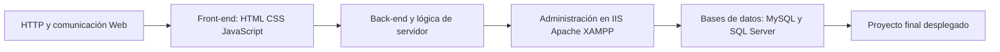

# Sitios-Public

### Curso de Administración y Programación de Sitios Web

Repositorio para aprender a crear, publicar y administrar sitios web modernos.

## Navegación rápida

| Tema | Acceso |
|---|---|
| Protocolo HTTP | [Abrir material](protocolo_http.md) |
| Administración básica de IIS | [Abrir material](administracion_iis.md) |
| Ejemplo guiado ASP clásico | [Abrir guía](ClassicASP/guia_asp_clasico.md) |

## ¿Qué vas a aprender?

Este curso combina desarrollo web y administración de infraestructura para que los estudiantes entiendan cómo funciona un sitio completo, desde la interfaz hasta su despliegue en servidor.

Se trabaja con práctica constante, ejercicios aplicados y escenarios reales de configuración, publicación y diagnóstico.

## Ruta de aprendizaje

## Stack tecnológico

## Enfoque del curso

- Desarrollo front-end para construir interfaces claras y responsivas.
- Programación del lado del servidor con tecnologías modernas y clásicas.
- Administración de sitios y aplicaciones en entornos de hosting.
- Diseño de soluciones conectadas a bases de datos relacionales.
- Integración de buenas prácticas de despliegue, mantenimiento y diagnóstico.

## Objetivo

Formar estudiantes capaces de desarrollar y administrar sitios web completos, comprendiendo el ciclo de vida técnico de una aplicación web: diseño, construcción, despliegue y operación.
