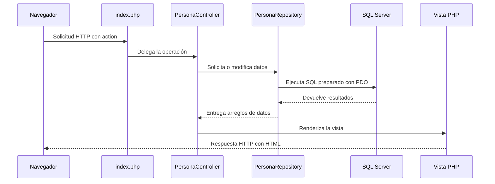
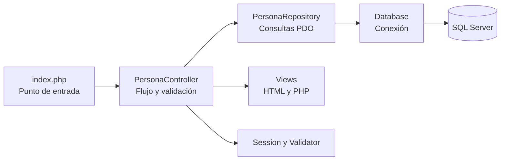

# Guía paso a paso: PHP, PDO y arquitectura por responsabilidades

<div align="center">


</div>

> Nota visual: este documento explica cómo una solicitud HTTP recorre el punto de entrada, el controlador, el repositorio y las vistas hasta producir el HTML que recibe el navegador.

## Navegación rápida

- [Qué tecnologías utiliza](#1-qué-tecnologías-utiliza-el-ejemplo)
- [Requisitos](#2-requisitos-para-ejecutarlo)
- [Arquitectura del ejemplo](#3-arquitectura-del-ejemplo)
- [Estructura del proyecto](#4-estructura-del-proyecto)
- [Flujo de ejecución](#5-qué-ocurre-cuando-el-navegador-envía-una-solicitud)
- [Explicación de index.php](#6-explicación-paso-a-paso-de-indexphp)
- [Controlador, repositorio y vistas](#7-controlador-repositorio-y-vistas)
- [Seguridad aplicada](#8-seguridad-aplicada)
- [Configuración y ejecución](#9-configuración-de-la-base-de-datos-y-ejecución)



Este documento complementa el [README del ejemplo](README.md), que contiene los pasos breves de instalación y configuración.

---

## 1. ¿Qué tecnologías utiliza el ejemplo?

### PHP 8.2

PHP es un lenguaje de programación ejecutado en el servidor. En este proyecto recibe la solicitud HTTP, valida los datos, consulta SQL Server y genera la respuesta HTML.

El código utiliza características modernas de PHP:

- Tipado estricto con `declare(strict_types=1)`.
- Clases con espacios de nombres.
- Promoción de propiedades en el constructor.
- Propiedades `readonly`.
- Expresiones `match`.
- Tipos de retorno como `void` y `never`.

### PDO

PDO, PHP Data Objects, ofrece una interfaz común para acceder a bases de datos. El controlador específico `pdo_sqlsrv` permite utilizar esa interfaz con SQL Server.

En el ejemplo, PDO se encarga de:

- Abrir la conexión.
- Preparar consultas SQL.
- Asociar parámetros.
- Ejecutar operaciones CRUD.
- Devolver los resultados como arreglos asociativos.

### SQL Server

SQL Server almacena los registros de la tabla `dbo.Persona`. El archivo [database/01_create_personas.sql](database/01_create_personas.sql) crea la tabla y un índice para ordenar y buscar por nombre.

### Apache y XAMPP

Apache recibe las solicitudes HTTP y ejecuta PHP. XAMPP puede utilizarse en Windows para instalar ambos componentes de forma sencilla.

SQL Server no forma parte de XAMPP: debe instalarse y configurarse por separado.

### Bootstrap, CSS y JavaScript

Bootstrap 5.3 proporciona la cuadrícula, formularios, tablas, botones, alertas y ventana modal. El proyecto añade:

- Estilos propios en [public/assets/css/app.css](public/assets/css/app.css).
- JavaScript en [public/assets/js/app.js](public/assets/js/app.js) para preparar la confirmación de eliminación.
- Bootstrap Icons para los elementos visuales de la interfaz.

---

## 2. Requisitos para ejecutarlo

Para abrir el ejemplo necesitas:

- PHP 8.2 o posterior.
- Apache u otro servidor web compatible con PHP.
- SQL Server.
- La extensión `pdo_sqlsrv` habilitada en PHP.
- Acceso a una base de datos donde pueda crearse `dbo.Persona`.

También se requiere la extensión `mbstring`, utilizada por las validaciones y por la generación de iniciales en el listado.

En Windows puede utilizarse XAMPP para Apache y PHP, junto con SQL Server y Microsoft Drivers for PHP for SQL Server.

---

## 3. Arquitectura del ejemplo

La aplicación no utiliza un framework completo. Implementa una estructura pequeña inspirada en MVC y separa las responsabilidades principales.



La responsabilidad de cada parte es:

- `index.php`: recibe la solicitud y selecciona la acción.
- `PersonaController`: coordina el caso de uso.
- `PersonaRepository`: concentra las consultas SQL.
- `Database`: crea y configura la conexión PDO.
- `Validator`: contiene las reglas de validación.
- `Session`: administra mensajes temporales y tokens CSRF.
- `Views`: producen el HTML presentado al usuario.

Esta separación permite estudiar principios usados por frameworks más grandes sin ocultar el recorrido de la solicitud.

---

## 4. Estructura del proyecto

```text
personafw/
|-- app/
|   |-- Config/
|   |-- Controllers/
|   |-- Core/
|   |-- Repositories/
|   |-- Views/
|   |-- .htaccess
|   `-- bootstrap.php
|-- database/
|   |-- .htaccess
|   `-- 01_create_personas.sql
|-- public/
|   `-- assets/
|       |-- css/
|       `-- js/
|-- .gitignore
|-- index.php
|-- guia_php_pdo.md
`-- README.md
```

### Archivos principales

- [index.php](index.php): punto de entrada y enrutador básico.
- [app/bootstrap.php](app/bootstrap.php): autocarga de clases y funciones auxiliares.
- [app/Controllers/PersonaController.php](app/Controllers/PersonaController.php): operaciones del CRUD.
- [app/Repositories/PersonaRepository.php](app/Repositories/PersonaRepository.php): persistencia con PDO.
- [app/Core/Database.php](app/Core/Database.php): creación de la conexión.
- [app/Core/Session.php](app/Core/Session.php): sesión, mensajes flash y CSRF.
- [app/Core/Validator.php](app/Core/Validator.php): validación de entrada.
- [app/Views/personas](app/Views/personas): listado y formulario.

---

## 5. Qué ocurre cuando el navegador envía una solicitud

El flujo general es el siguiente:

1. Apache recibe una URL como `index.php?action=edit&id=123`.
2. PHP ejecuta [index.php](index.php).
3. `app/bootstrap.php` registra la autocarga y las funciones auxiliares.
4. Se inicia la sesión.
5. Se carga la configuración local de la base de datos.
6. `Database::connect()` crea la conexión PDO.
7. Se construyen `PersonaRepository` y `PersonaController`.
8. La expresión `match` selecciona la operación indicada por `action`.
9. El controlador valida la solicitud y usa el repositorio cuando necesita datos.
10. La función `render()` carga el layout y la vista correspondiente.
11. El navegador recibe únicamente el HTML resultante.

El navegador no recibe las credenciales, el código PHP ni las consultas SQL.

---

## 6. Explicación paso a paso de `index.php`

### 6.1 Tipado estricto

```php
declare(strict_types=1);
```

PHP evita conversiones implícitas permisivas en llamadas a funciones tipadas, lo cual ayuda a detectar errores antes.

### 6.2 Carga del entorno

```php
require __DIR__.'/app/bootstrap.php';
Session::start();
```

El archivo de arranque registra la autocarga de clases y define utilidades como `render()`, `redirect()`, `e()` y `url()`. Después se inicia una sesión con opciones de cookie más seguras.

### 6.3 Configuración y dependencias

```php
$config = require __DIR__.'/app/Config/database.php';
$repository = new PersonaRepository(Database::connect($config));
$controller = new PersonaController($repository);
```

La configuración local alimenta la conexión PDO. Esa conexión se entrega al repositorio y el repositorio se entrega al controlador.

Es una forma manual y sencilla de inyección de dependencias.

### 6.4 Selección de la acción

```php
$action = filter_input(INPUT_GET, 'action') ?: 'index';
```

Si la URL no contiene una acción, se utiliza `index` y se muestra el listado.

```php
match ($action) {
    'index' => $controller->index(),
    'create' => $controller->create(),
    'store' => $controller->store(),
    'edit' => $controller->edit(),
    'update' => $controller->update(),
    'delete' => $controller->delete(),
    default => $controller->notFound(),
};
```

Este bloque funciona como un enrutador básico. Relaciona cada valor de `action` con un método del controlador.

### 6.5 Manejo de errores

Las excepciones no controladas producen una respuesta HTTP 500, se registran mediante `error_log()` y muestran al usuario una vista genérica. Así se evita exponer detalles internos de la conexión o del servidor.

---

## 7. Controlador, repositorio y vistas

### 7.1 Controlador

`PersonaController` contiene las acciones del CRUD:

- `index()`: obtiene una página de registros.
- `create()`: muestra el formulario vacío.
- `store()`: valida y crea una persona.
- `edit()`: busca el registro y muestra el formulario.
- `update()`: valida y actualiza el registro.
- `delete()`: elimina mediante una solicitud `POST`.

El controlador no contiene consultas SQL ni construye directamente el HTML.

### 7.2 Repositorio

`PersonaRepository` encapsula las operaciones sobre `dbo.Persona`:

- Paginación mediante `OFFSET` y `FETCH NEXT`.
- Búsqueda por identificador.
- Verificación de identificadores duplicados.
- Inserción.
- Actualización.
- Eliminación.

Las consultas que reciben datos externos usan sentencias preparadas y parámetros.

### 7.3 Vistas

Las vistas combinan HTML con expresiones PHP pequeñas:

- `personas/index.php` muestra la tabla, paginación y modal de eliminación.
- `personas/form.php` reutiliza un mismo formulario para crear y editar.
- `layouts/header.php` y `layouts/footer.php` definen la estructura común.
- `errors/404.php`, `419.php` y `500.php` presentan respuestas de error.

La función `e()` aplica `htmlspecialchars()` antes de insertar texto variable en HTML.

---

## 8. Seguridad aplicada

El ejemplo incorpora varias medidas importantes:

1. Consultas preparadas para reducir el riesgo de inyección SQL.
2. Escape de salida con `htmlspecialchars()` para reducir el riesgo de XSS.
3. Tokens CSRF en formularios que modifican datos.
4. Operaciones de creación, actualización y eliminación restringidas a `POST`.
5. Contraseñas almacenadas mediante `password_hash()`.
6. Credenciales separadas en `database.local.php`, excluido por `.gitignore`.
7. Cookies de sesión con `HttpOnly`, `SameSite=Lax` y modo estricto.
8. Mensajes de error genéricos para no revelar detalles internos.
9. Archivos `.htaccess` que impiden servir directamente las carpetas `app` y `database` cuando Apache permite sobrescrituras.

Estas medidas son una base didáctica. En producción también deben utilizarse HTTPS, permisos mínimos de base de datos, gestión segura de secretos y una configuración endurecida del servidor.

---

## 9. Configuración de la base de datos y ejecución

### 9.1 Crear la tabla

Ejecuta [database/01_create_personas.sql](database/01_create_personas.sql) en SQL Server. Si la base de datos no se llama `Ejemplo2`, cambia la instrucción `USE`.

### 9.2 Crear la configuración local

Copia:

```text
app\Config\database.example.php
```

como:

```text
app\Config\database.local.php
```

Completa el servidor, la base de datos, el usuario y la contraseña.

### 9.3 Publicar el ejemplo

Con XAMPP, la carpeta puede copiarse en:

```text
C:\xampp\htdocs\personafw
```

Después se abre:

```text
http://localhost/personafw/
```

Para instrucciones más breves y resolución de configuración, consulta el [README del ejemplo](README.md).

---

## 10. Conclusión

Este ejemplo muestra cómo construir un CRUD organizado con PHP sin depender de un framework completo. Su valor didáctico está en hacer visible el recorrido completo: solicitud HTTP, enrutamiento, validación, sesión, controlador, repositorio PDO, SQL Server y renderizado de vistas.

También sirve como puente hacia frameworks PHP modernos, que automatizan muchas de estas tareas pero conservan conceptos equivalentes.
