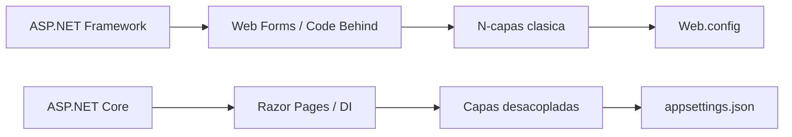

# Resumen de tecnologías usadas en los ejemplos ASPNetSample y CoreWebSample

## Navegacion rapida

- [ASP.NET Framework](#1-aspnet-framework)
- [ASP.NET Core](#2-aspnet-core)
- [Dapper y SQL Server](#3-dapper-y-sql-server)
- [Comparacion de arquitectura](#4-comparacion-de-arquitectura)
- [Estructura tipica de proyectos](#5-estructura-tipica-de-proyectos)
- [Conclusiones](#6-conclusiones)

## 1. ASP.NET Framework

ASP.NET Framework es la plataforma web tradicional de Microsoft sobre .NET Framework. Surgió como evolución de ASP clásico para ofrecer un modelo más estructurado y productivo, con Web Forms, controles de servidor, master pages y un ciclo de vida de página más rico.

### Historia breve

- Nace dentro de .NET Framework como respuesta al desarrollo web dinámico clásico.
- Web Forms se vuelve muy popular en aplicaciones empresariales por su rapidez para construir CRUD y pantallas internas.
- Con el tiempo, el ecosistema se orienta hacia arquitecturas más desacopladas y hacia ASP.NET Core.

### Arquitectura típica

- Capa de presentación con Web Forms o MVC clásico.
- Lógica de negocio en bibliotecas separadas.
- Acceso a datos en otra capa o proyecto.
- Entidades compartidas como contratos entre capas.
- Configuración centralizada en `Web.config`.

### En este repositorio

El ejemplo [ASPNetSample/ASPNetSample.sln](ASPNetSample/ASPNetSample.sln) usa una arquitectura n-capas clásica:

- UI Web Forms.
- `PersonaService` como capa de negocio.
- `PersonaDA` como acceso a datos.
- `Persona` como entidad.

---

## 2. ASP.NET Core

ASP.NET Core es la plataforma moderna de Microsoft para aplicaciones web sobre .NET. Fue reescrita para ser modular, multiplataforma, de alto rendimiento y preparada para despliegues modernos.

### Historia breve

- Aparece como evolución mayor de ASP.NET, ya no atada a .NET Framework.
- Adopta un host moderno, middleware, DI integrada y un diseño más pequeño y componible.
- Se convierte en la base de la plataforma web actual de .NET.

### Arquitectura típica

- Un host configurado desde `Program.cs`.
- Middleware para el pipeline HTTP.
- Razor Pages, MVC o APIs como superficie web.
- Servicios registrados en el contenedor de dependencias.
- Repositorios o servicios de dominio para separar la lógica de acceso a datos.
- Configuración en `appsettings.json` y archivos por entorno.

### En este repositorio

El ejemplo [CoreWebSample/CoreWebSample.sln](CoreWebSample/CoreWebSample.sln) usa un diseño por capas más moderno:

- Razor Pages como UI.
- `PersonaService` como servicio de aplicación.
- `PersonaRepository` como repositorio de datos.
- `DbConnectionFactory` como infraestructura de conexión.
- `Persona` como entidad compartida.

---

## 3. Dapper y SQL Server

Ambos ejemplos usan SQL Server como motor de base de datos y Dapper como micro-ORM.

### ¿Qué aporta Dapper?

- Mapeo directo entre filas y objetos.
- Muy poco costo de abstracción.
- SQL explícito, fácil de entender en ejemplos de clase.

### En la práctica

- ASPNetSample usa consultas síncronas con Dapper.
- CoreWebSample usa consultas asíncronas con Dapper.

---

## 4. Comparacion de arquitectura

### Diferencias principales

1. ASP.NET Framework depende de `Web.config` y de un modelo de hosting más clásico.
2. ASP.NET Core usa `Program.cs`, middleware y un contenedor de dependencias integrado.
3. Web Forms tiende a apoyarse en eventos de página y code-behind.
4. Razor Pages organiza la UI por página y `PageModel`, con una experiencia más simple y moderna.
5. ASP.NET Core favorece el uso de `async` y `Task` desde el inicio.

---

## 5. Estructura tipica de proyectos

### En ASP.NET Framework

Lo común es ver:

- Un proyecto web principal.
- Bibliotecas separadas para negocio y acceso a datos.
- Entidades compartidas.
- Configuración en `Web.config`.
- Master pages y controles de servidor.

### En ASP.NET Core

Lo común es ver:

- Un proyecto web con `Program.cs` y carpetas `Pages`, `Controllers` o `Endpoints`.
- Proyectos de servicios y repositorios separados si la solución crece.
- Configuración por archivos JSON y variables de entorno.
- Dependencias registradas explícitamente.
- Código asíncrono para operaciones I/O.

### En estos ejemplos

- [ASPNetSample/ASPNetSample.sln](ASPNetSample/ASPNetSample.sln) muestra una solución dividida en presentación, negocio, datos y entidades.
- [CoreWebSample/CoreWebSample.sln](CoreWebSample/CoreWebSample.sln) muestra una solución web moderna con proyecto principal, servicios, repositorio y entidades.

---

## 6. Conclusiones

Los dos ejemplos enseñan la misma idea de fondo desde generaciones distintas de la plataforma:

- ASP.NET Framework ayuda a entender el modelo clásico de aplicaciones empresariales en .NET.
- ASP.NET Core muestra la versión moderna, más modular y preparada para aplicaciones actuales.
- Dapper y SQL Server permiten enfocarse en arquitectura y datos sin esconder demasiado el SQL real.

Si se estudian juntos, el valor está en comparar cómo cambia la estructura del proyecto, el arranque de la aplicación y la forma de desacoplar responsabilidades.

Para el proyecto se usará una estructura como la del proyecto CoreWebSample.